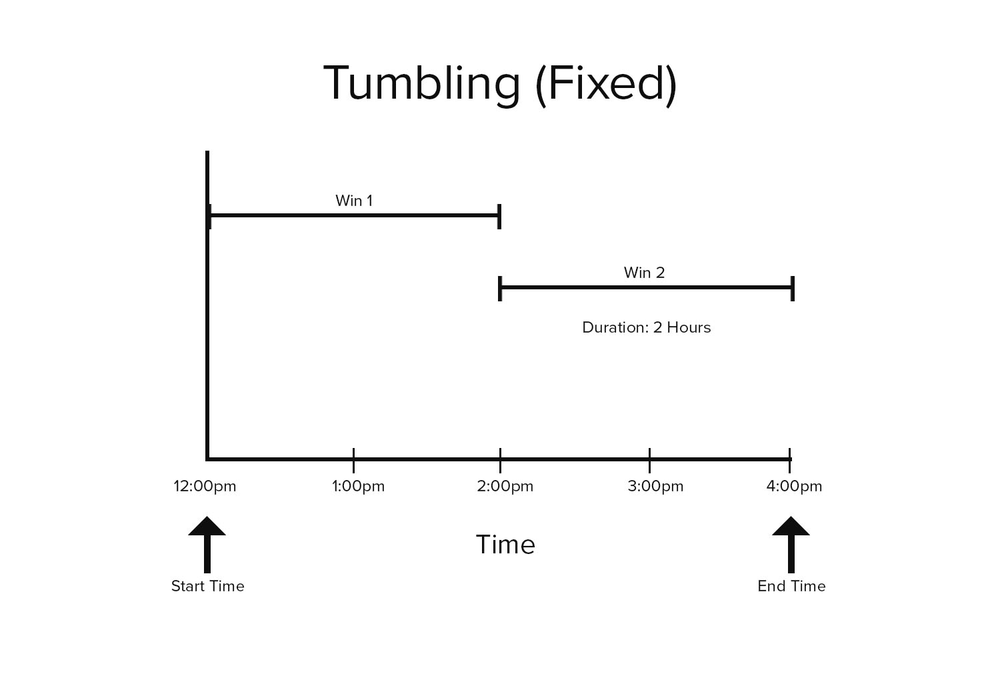

# ScaleOut Time Windowing Library for .NET

## Introduction

The ScaleOut Time Windowing Library for .NET provides a set of
windowing functions for time-ordered collections of events. These
windowing functions are provided as extensions methods that can
operate on any `IEnumerable<T>` collection.

### Example

    using Scaleout.Client.Streaming.Linq;
	
    class HeartRate {
		public DateTime Timestamp { get; set; } // assumes UTC
		public short BeatsPerMinute { get; set; }
	}

    // Given heart-rate readings every minute, calculate the 5-minute
	// moving average of a person's heart rate for the past 24 hours.
	
	var readings = new List<HeartRate>();
	// [...time-ordered readings populated here, one per minute]
	
    var slidingWindows = readings.ToSlidingWindows(
            timestampSelector: hb => hb.Timestamp,
            startTime: DateTime.UtcNow - TimeSpan.FromHours(24),
            endTime: DateTime.UtcNow,
            windowDuration: TimeSpan.FromMinutes(5),
            every: TimeSpan.FromMinutes(1));

	// print each window's boundaries and its heartbeat average:
    foreach (var win in slidingWindows)
        Console.WriteLine($"{win.StartTime:t} - {win.EndTime:t}: {win.Average(hb => hb.BeatsPerMinute)}");
	
The library also provides convenience classes for management of
collections of time-ordered elements. These classes offer automatic
eviction and ordering of elements, and they are suited for scenarios
where elements are only accessed and analyzed as a windowed
transformation. See the [Wrapper Classes](#WrapperClasses) section for
details.

## Windowing Methods

Three methods are provided to break up an enumerable collection into
different kinds of time windows. These are available as extension
methods in the `Scaleout.Client.Streaming.Linq` namespace:

1. **ToSlidingWindows**: Transforms a collection into an enumerable
   collection of overlapped (sliding) windows.
2. **ToTumblingWindows**: Transforms a collection into an enumerable
   collection of fixed-duration windows.
3. **ToSessionWindows**: Transforms a collection into an enumerable
   collection of session windows.
   
The windowing methods accept a user-defined `Func<T, DateTime>` delegate that
returns the time associated with each element in the collection. This
timestamp is used to determine which window (or windows, in the case
of the sliding windows) an element belongs to.

Each method returns a collection of `ITimeWindow` objects. An
`ITimeWindow` instance is itself an enumerable collection of the elements in
the source collection whose timestamps fall within the window's time
span.

### Sliding Windows

Sliding window functions are often used to calculate the moving
average of time series data. The duration of sliding windows is larger
than the period between the windows, so the period of time covered by
each window overlaps with its neighbors:

If no elements fall in a sliding time window, that window will be
empty.

To use the library's `ToSlidingWindows` method, the source collection
*must* be sorted chronologically. (See
the [Wrapper Classes](#WrapperClasses) section below for details on
convenient wrapper classes that keep your source collection sorted.)

    public static IEnumerable<ITimeWindow<TSource>> ToSlidingWindows<TSource>(
        this IEnumerable<TSource> source, 
        Func<TSource, DateTime> timestampSelector,
        DateTime startTime, 
        DateTime endTime, 
        TimeSpan windowDuration, 
        TimeSpan every)

**Parameters**
<dl>
<dt>source</dt><dd>The sequence of elements to transform.</dd>
<dt>timestampSelector</dt><dd>A function to extract a timestamp from an element.</dd>
<dt>startTime</dt><dd>Start time (inclusive) of the first sliding window.</dd>
<dt>endTime</dt><dd>End time (exclusive) for the last sliding window(s).</dd>
<dt>windowDuration</dt><dd>Duration of each time window. This is a maximum value that will be shortened for the last window(s) in the returned sequence.</dd>
<dt>every</dt><dd>The period of time between the start of each sliding window.</dd>
</dl>

### Tumbling Windows

Tumbling windows, (or "fixed" windows), divide time series data into
periodic, non-overlapping windows. Unlike sliding time windows, an
element in a collection of tumbling windows may only appear in a
single window.

If no elements fall in a tumbling time window, that window will be
empty.

To use the library's `ToTumblingWindows` method, the source collection
*must* be sorted chronologically. (See
the [Wrapper Classes](#WrapperClasses) section below for details on
convenient wrapper classes that keep your source collection sorted.)

    public static IEnumerable<ITimeWindow<TSource>> ToTumblingWindows<TSource>(
        this IEnumerable<TSource> source, 
        Func<TSource, DateTime> timestampSelector,
        DateTime startTime, 
        DateTime endTime, 
        TimeSpan windowDuration)

**Parameters**
<dl>
<dt>source</dt><dd>The sequence of elements to transform.</dd>
<dt>timestampSelector</dt><dd>A function to extract a timestamp from an element.</dd>
<dt>startTime</dt><dd>Start time (inclusive) of the first tumbling window.</dd>
<dt>endTime</dt><dd>End time (exclusive) for the last tumbling window.</dd>
<dt>windowDuration</dt><dd>Duration of each time window. This is a maximum value that will be shortened for the last window in the returned sequence.</dd>
</dl>

### Session Windows

The duration of a session window is not fixed; rather, it is
determined by the time interval between elements: if a period of idle
time elapses between elements then a new session window is
created.

Session windowing is often used when processing click data or
other types of user activity--if a user is inactive for too long then
the session window closed. A new session window is created once user
activity resumes.

Unlike sliding and tumbling window functions, a session window is
never empty.

Like the other windowing fuctions, the `ToSessionWindows` method
requires the source collection to be sorted chronologically. (See
the *Wrapper Classes* section below for details on convenient wrapper
classes that keep your source collection sorted.)

    public static IEnumerable<ITimeWindow<TSource>> ToSessionWindows<TSource>(
        this IEnumerable<TSource> source, 
        Func<TSource, DateTime> timestampSelector,
        TimeSpan idleThreshold)

**Parameters**
<dl>
<dt>source</dt><dd>The sequence of elements to transform.</dd>
<dt>timestampSelector</dt><dd>A function to extract a timestamp from an element.</dd>
<dt>idleThreshold</dt><dd>Maximum allowed time gap between elements before a new session window is started.</dd>
</dl>

## Wrapper Classes

In addition to the three extension methods detailed above, the library
provides three wrapper classes to aid in the management and processing
of time-ordered events. The `SessionWindowCollection<T>`,
`SlidingWindowCollection<T>`, and `TumblingWindowCollection<T>` classes
wrap a source collection (typically a `List<T>` or `LinkedList<T>`)
and manage its elements.

These wrapper classes are intended to be used as alternatives to the
library's extension methods when the underlying elements are accessed
primarily as a windowed collection. It is therefore expected that the
elements in the underlying source collection will only be accessed and
modified through the chosen wrapper. These wrappers perform the
following work on your behalf:

* **Eviction:** Eviction of elements is automatically handled, as
  specified by the policy passed into the wrapper's
  constructor. Eviction is performed when the wrapper collection is
  constructed and when new items are added through the
* **Ordering:** When elements are added through a wrapper's `Add()`
  method, it is inserted into the underlying collection in the correct
  chronological position.
  
Once constructed, the wrapper can be enumerated to access its
associated time windows.

### Sliding Window Wrapper

The `SlidingWindowCollection<T>` class provides the following constructor:

    public SessionWindowCollection(
        IList<T> source,
        Func<T, System.DateTime> timestampSelector,
        TimeSpan windowDuration,
        TimeSpan every
        DateTime startTime)

The parameters to this constructor are similar to the parameters to
the `ToSlidingWindows` extension method, except that the `startTime`
parameter defines the eviction policy for the collection as well as
the starting point for the windowing transform--elements with
timestamps prior to `startTime` will be removed from the source
collection.

Also, there is no `endTime` parameter in the wrapper's constructor
like there is in the `ToSlidingWindows` method. When enumerating
through sliding windows exposed by the wrapper, the end time is
implicitly set to the last (most recent) element in the source
collection.

Once constructed, the wrapper's `Add()` method should be used to add
elements to the array.

### Tumbling Window Wrapper

The `TumblingWindowCollection<T>` class provides the following constructor:

    public TumblingWindowCollection(
        IList<T> source,
        Func<T, System.DateTime> timestampSelector,
        TimeSpan windowDuration,
        DateTime startTime)

The parameters to this constructor are similar to the parameters to
the `ToTumblingWindows` extension method, except that the `startTime`
parameter defines the eviction policy for the collection as well as
the starting point for the windowing transform. Elements with
timestamps prior to `startTime` will be removed from the source
collection.

Also, there is no `endTime` parameter in the wrapper's constructor
like there is in the `ToTumblingWindows` method. When enumerating
through windows exposed by the wrapper, the end time is implicitly set
to the last (most recent) element in the source collection.

Once constructed, the wrapper's `Add()` method should be used to add
elements to the array.

### Session Window Wrapper

The `SessionWindowCollection<T>` class provides the following constructor:

    public SessionWindowCollection(
        IList<T> source,
        Func<T, System.DateTime> timestampSelector,
        System.TimeSpan idleThreshold,
        int boundedSessionCapacity)

The parameters to this constructor are largely identical to the
paramaters to the `ToSessionWindows` extension method, with the
exception of the additional `boundedSessionCapacity`, which defines
how many sessions worth of elements to keep in the underlying
collection. If the `boundedSessionCapacity` is exceeded then the
elements associated with the oldest session(s) at the front of the
source collection will be removed.

Once constructed, the wrapper's `Add()` method should be used to add
elements to the source collection instead of adding elements directly
to the source collection. If the wrapper's `Add()` operation results
in the creation of a new session window then it may evict elements in
accordance to the wrapper's `boundedSessionCapacity` policy.
